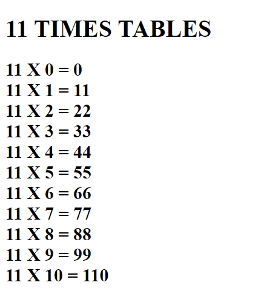
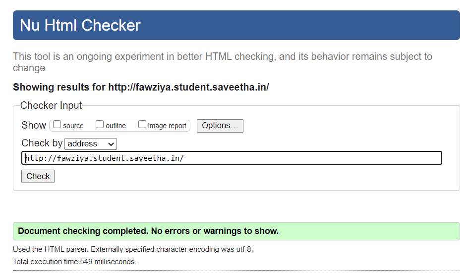

# Developing a Simple Webserver
## AIM:
To develop a simple webserver to serve html pages.

## DESIGN STEPS:
### Step 1: 
HTML content creation
### Step 2:
Design of webserver workflow
### Step 3:
Implementation using Python code
### Step 4:
Serving the HTML pages.
### Step 5:
Testing the webserver

## PROGRAM:
## mywebserver.py
```
from http.server import HTTPServer,BaseHTTPRequestHandler

Content="""
<!doctype html>
<html>
<head>
<title>my webserver</title>
</head>
<body>
<h1>11 TIMES TABLES</h1>
<h2>11 X 0 = 0<br>
11 X 1 = 11<br>
11 X 2 = 22<br>
11 X 3 = 33<br>
11 X 4 = 44<br>
11 X 5 = 55<br>
11 X 6 = 66<br>
11 X 7 = 77<br>
11 X 8 = 88<br>
11 X 9 = 99<br>
11 X 10 = 110<br>
</body>
</html>
"""

class myhandler(BaseHTTPRequestHandler):
    def do_GET(self):
        print("request recived")

        self.send_response(200)
        self.send_header('content-type','text/html; charset=utf-8')             
        self.end_headers()

     #to send the responce
        self.wfile.write(Content.encode())

 #to create server address     
server_address=('',80)

#to listen at the specified port
httpd = HTTPServer(server_address,myhandler)
print("MY WEBSERVER IS RUNNING...")
httpd.serve_forever()
```

## OUTPUT:





## RESULT:
Thus, a webserver is designed to display multiplication table and is hosted in the URL
http://fawziya.student.saveetha.in/